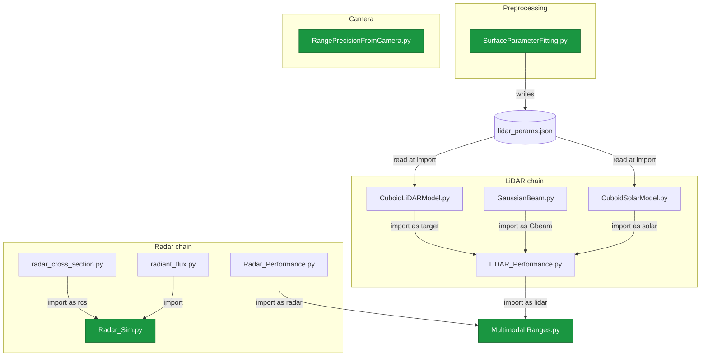

# SenseAndEffect — Architecture and Data Flow

A sensor trade study for detecting an Earth orbiting cuboid target across three modalities: LiDAR, radar, and a passive camera. The code splits into a LiDAR chain, a radar chain, a standalone camera calculation, and one top level script that pulls the LiDAR and radar pieces together.

## Dependency graph

Green nodes are the things you actually run. Everything else is a library imported by something else.

## Entry points

Four scripts are meant to be run directly, plus two modules that double as runnable test harnesses.

- **Multimodal Ranges.py** — the headline trade study. Computes minimum range and required transmit power/energy for flash LiDAR, scanning LiDAR, radar, and camera as a function of field of view, then plots it.
- **Radar_Sim.py** — standalone radar Monte Carlo. Produces SNR scatter and detection probability contours vs bearing and range.
- **RangePrecisionFromCamera.py** — standalone camera range precision from pixel count. Self contained, no project imports.
- **SurfaceParameterFitting.py** — one off preprocessing. Fits the BRDF model to measured reflectance and regenerates `lidar_params.json`. Run this whenever the measured data changes; the LiDAR models read its output.
- **LiDAR_Performance.py** and **CuboidSolarModel.py** also have `__main__` blocks, so they can be run alone for their own Monte Carlo or plot.

## File reference

| File | Role | Imports (internal) | Imported by | External libs | Side effects on import |
|------|------|--------------------|-------------|---------------|------------------------|
| `lidar_params.json` | Fitted BRDF coefficients (kd, kr, beta) per material | — | CuboidLiDARModel, CuboidSolarModel | — | data file |
| `SurfaceParameterFitting.py` | Fit BRDF to measured data, write the JSON | — | — | numpy, scipy, pandas, matplotlib | runs fit, shows plot, **writes JSON** |
| `GaussianBeam.py` | Gaussian beam radius and irradiance vs range | — | LiDAR_Performance | numpy, matplotlib | none (pure defs) |
| `CuboidLiDARModel.py` | Monostatic LiDAR return off a cuboid | — | LiDAR_Performance | numpy, json | **opens JSON at import** |
| `CuboidSolarModel.py` | Bistatic solar reflection off a cuboid | — | LiDAR_Performance | numpy, json, matplotlib | **opens JSON at import** |
| `LiDAR_Performance.py` | Full LiDAR SNR model + Monte Carlo | CuboidLiDARModel, GaussianBeam, CuboidSolarModel | Multimodal Ranges | numpy, scipy, matplotlib | none past its imports |
| `radar_cross_section.py` | RCS lookup table, dBsm to m^2, interpolation | — | Radar_Sim | (none) | none |
| `radiant_flux.py` | Orbital radiant flux lookup table | — | Radar_Sim | (none) | none |
| `Radar_Performance.py` | Symbolic radar range equation + solver, gain approx | — | Multimodal Ranges | numpy, sympy | defines sympy symbols |
| `Radar_Sim.py` | Radar SNR Monte Carlo with thermal noise floor | radar_cross_section, radiant_flux | — | numpy, scipy, matplotlib | none past its imports |
| `RangePrecisionFromCamera.py` | Camera range precision from subtended pixels | — | — | numpy, matplotlib | runs calc, shows plot |
| `Multimodal Ranges.py` | Cross modality FoV trade study | Radar_Performance, LiDAR_Performance | — | numpy, matplotlib | runs study, shows plot |

## Data flow

**LiDAR signal path.** `SurfaceParameterFitting` fits measured reflectance and writes `lidar_params.json`. At run time `GaussianBeam` gives the beam irradiance at the target, `CuboidLiDARModel` turns that into a BRDF weighted return using the JSON coefficients, and `CuboidSolarModel` supplies the solar background. `LiDAR_Performance` combines all three into photons per pulse, an SNR, and a Monte Carlo over orientation, range, and sun direction.

**Radar path.** `radar_cross_section` provides the target RCS at a given aspect and `radiant_flux` provides the orbital thermal environment used to derive the receiver noise temperature. `Radar_Sim` ties them together through the radar equation and runs its own Monte Carlo. Separately, `Radar_Performance` holds a symbolic form of the radar equation used by the trade study.

**Camera path.** `RangePrecisionFromCamera` stands alone: target width plus angular resolution gives subtended pixels, and a blur term gives the resulting range uncertainty.

**Top level.** `Multimodal Ranges` is the only true integrator. It imports `LiDAR_Performance` (which transitively drags in the whole LiDAR chain and the JSON) and `Radar_Performance`, then solves each modality for the power or resolution needed at a FoV driven minimum range.

## Structural notes worth knowing

- **`Radar_Sim` does not use `Radar_Performance`.** It reimplements the radar equation inline. `Radar_Performance` is consumed only by `Multimodal Ranges`. So the two radar files are independent rather than layered, which is easy to misread.

- **`lidar_params.json` is read at import time with a relative path.** Both `CuboidLiDARModel` and `CuboidSolarModel` call `open("lidar_params.json")` at module top level, so anything importing them (directly or via `LiDAR_Performance` and `Multimodal Ranges`) must run with the working directory set to the project root, or the import fails. The dependency is implicit and not obvious from the import lines.

- **Three scripts run heavy work at module top level with no `__main__` guard:** `Multimodal Ranges.py`, `RangePrecisionFromCamera.py`, and `SurfaceParameterFitting.py`. Importing any of them executes the full computation and pops a plot. The guarded modules are `CuboidLiDARModel`, `CuboidSolarModel`, `LiDAR_Performance`, and `Radar_Sim`.

- **`Multimodal Ranges.py` cannot be imported.** The space in the filename makes it script only, which is fine since it sits at the top of the graph and nothing depends on it.

- **`Multimodal Ranges` rebinds names it imports.** It does `from Radar_Performance import lambda_radar, Pr_radar, Pt_radar, RCS_radar` and then overwrites those same names inside its loop, so the imported values are shadowed rather than used.

## External dependencies

numpy (all modules), matplotlib (everything except the two pure lookup tables and Radar_Performance), scipy (LiDAR_Performance, Radar_Sim, SurfaceParameterFitting), sympy (Radar_Performance), pandas (SurfaceParameterFitting).
